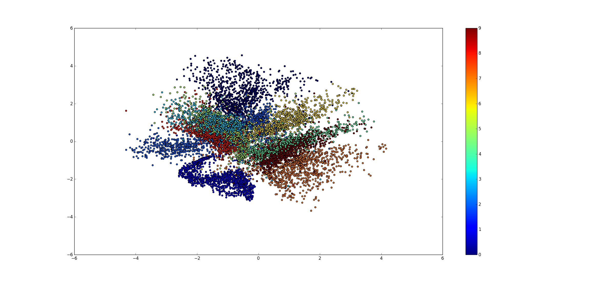
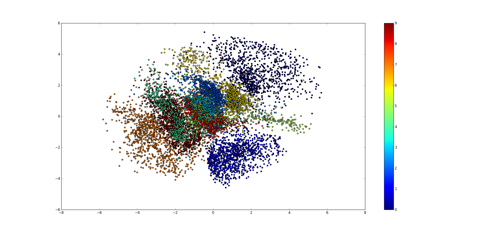
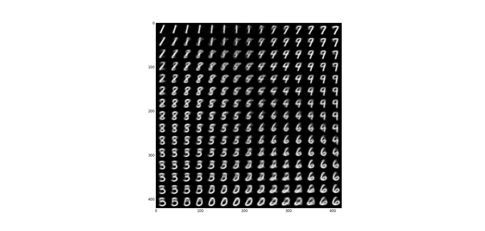
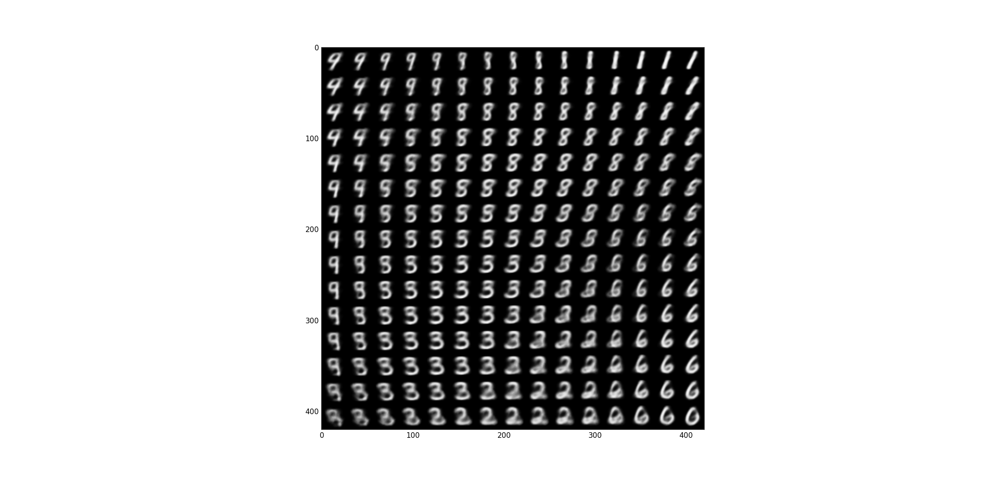
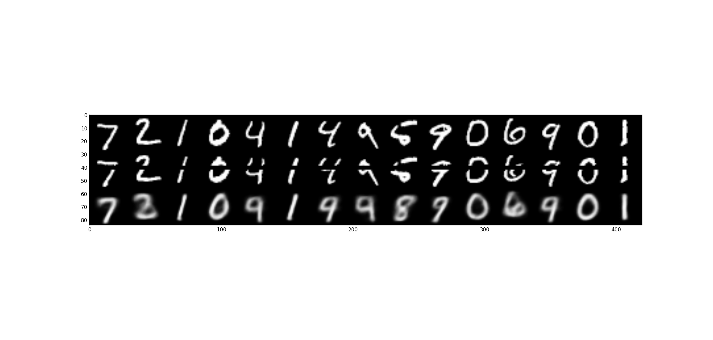

Simple keras implementation of Variational Auto-Encoder (VAE) on MNIST

> This repo is with the [blog on VAE (in Chinese)](http://blog.csdn.net/jackytintin/article/details/53641885).

## Learned latent space
### MSE loss

### crossentropy loss

## Learned manifold 
### MSE loss

### crossentropy loss

## Imputation
### MSE loss

### crossentropy loss

## Refenreces:
* Kingma et al. [https://arxiv.org/abs/1312.6114](Auto-Encoding Variational Bayes).
